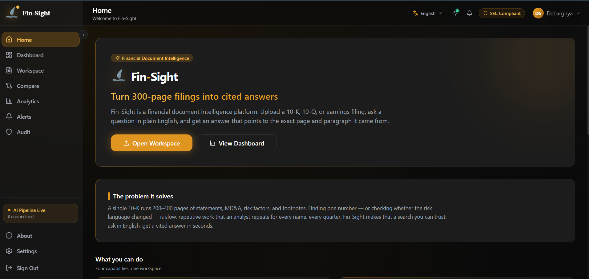
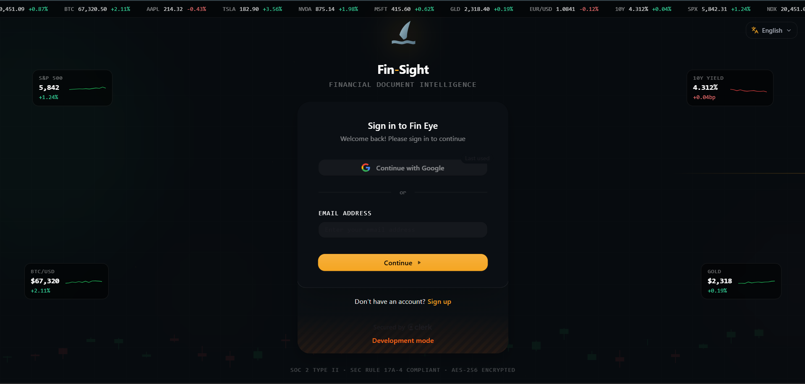
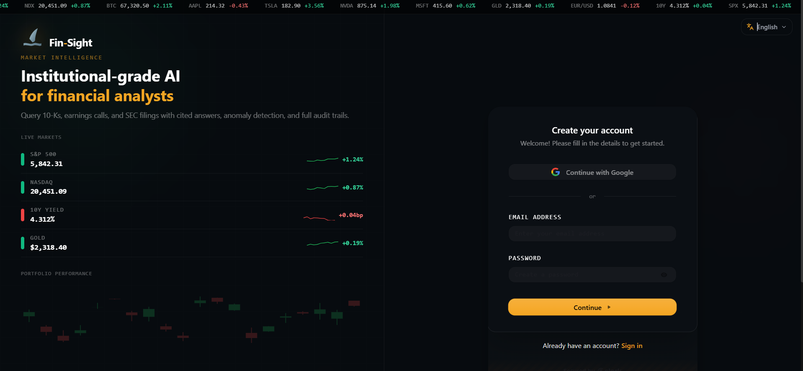
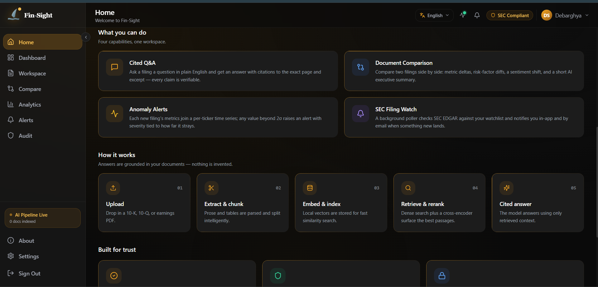
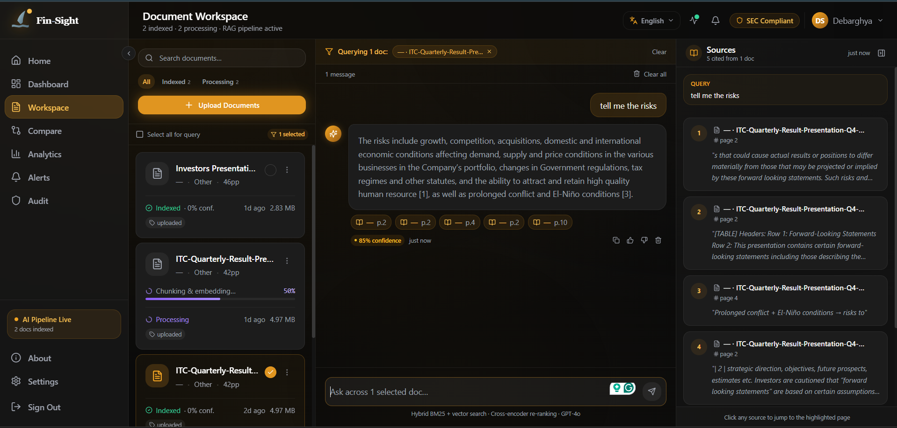
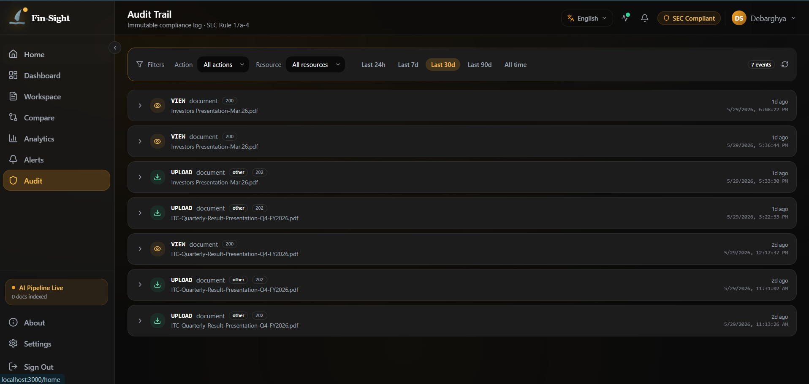

<div align="center">
  
  <h3>Fin-Sight: building a production-grade financial RAG platform on a $0/month stack</h3>
  <p><em>A technical blog post by <strong>Debarghya Sengupta</strong></em></p>
  <p>
    
    
    
    
    
    
    
    
  </p>
</div>

---

## 🎬 Demo

<div align="center">
  <a href="https://youtu.be/PE4CrusqRfg" target="_blank">
    
  </a>
  <br/>
  <a href="https://youtu.be/PE4CrusqRfg">▶ Watch the full demo on YouTube</a>
</div>

---

## Table of contents

1. [The problem](#1-the-problem)
2. [What I built](#2-what-i-built)
3. [Architecture](#3-architecture)
4. [Engineering decisions and the reasoning behind them](#4-engineering-decisions-and-the-reasoning-behind-them)
5. [Performance benchmarks](#5-performance-benchmarks)
6. [Cost analysis at 1,000 users](#6-cost-analysis-at-1000-users)
7. [Testing strategy](#7-testing-strategy)
8. [What I would do differently](#8-what-i-would-do-differently)
9. [Quick start](#9-quick-start)
10. [API reference](#10-api-reference)
11. [Repository layout](#11-repository-layout)
12. [License](#12-license)

---

## 1. The problem

A US listed company's 10-K runs 200–400 pages. An equity analyst opening the FY23 Apple 10-K to find "did R&D spend grow faster than revenue this year?" is looking at:

- two pages of carefully formatted income statement,
- a five-page MD&A section,
- a ten-page risk factors section that mostly carries forward prior language,
- and a long string of footnotes describing how each line item was computed.

The work is *not hard*. It's *slow*. And it has to be done for every filing every quarter, multiplied by every name on a coverage list. The pattern that came up over and over again whenever I talked to analysts was: *"I just need a search engine that understands tables and can quote the source paragraph back to me, and I'd save four hours a week."*

That is the problem **Fin-Sight** solves: upload a filing, ask a question in English, get a cited answer that points to the exact page and excerpt. Multi-document comparison, anomaly alerts, and SEC-filing notifications followed naturally.

The constraint I gave myself: **build it on a $0/month infrastructure budget**, so it's both a credible portfolio project and something a single analyst could actually self-host — on a vanilla Windows laptop, with no Docker and no paid SaaS.

---

## 2. What I built

Fin-Sight is a multi-tenant RAG platform with four user-facing capabilities:

1. **Cited Q&A over uploaded filings** — dense retrieval, cross-encoder reranking, JSON-mode LLM with strict citation prompting.
2. **Side-by-side document comparison** — extracts a structured set of financial metrics from two filings, computes the deltas, diffs the risk factors, and writes a one-paragraph executive summary.
3. **Anomaly alerts** — every new filing's metrics are written to a per-ticker time series; values that fall more than 2σ outside the historical mean fire an alert with severity tied to |z|.
4. **Proactive SEC filing watch** — a background poller checks SEC EDGAR for new filings against the user's watchlist and pushes alerts (in-app + email).

It's a working web app: Next.js front-end, FastAPI back-end, and a single PostgreSQL database that holds **everything that matters** — document metadata, chunks, the audit log, alerts, ticker subscriptions, comparison results, *and the vector embeddings themselves*. There is no separate vector database, no Redis, and no message broker in the default setup. Auth is Clerk. The LLM is Llama 3.3 70B served through Groq. Every embedding runs locally on CPU.

The deliberate design choice that makes the $0 budget possible: **the only stateful service is PostgreSQL.** Vectors are stored as JSON in a `chunk_embeddings` table and cosine similarity is computed in Python at query time, so the whole thing runs on a stock PostgreSQL install with zero extensions — and on SQLite in the test suite.

Total runtime cost in dev: **$0**. Total runtime cost in production at 1,000 users: about **$386/month** — roughly **6–7× cheaper** than the equivalent paid stack (see [§6](#6-cost-analysis-at-1000-users)), with the dominant line being GPT-4o vs Groq Llama, not the database.

### Screenshots

<div align="center">

**Landing page — sign in with live market data tickers**



<br/><br/>

**Sign-up — institutional-grade positioning with live portfolio chart**



<br/><br/>

**Home dashboard — four capabilities, one workspace**


<br/>



<br/><br/>

**Document workspace — RAG Q&A with cited sources in real time**



</div>

---

## 3. Architecture

```text
                          ┌──────────────────┐
                          │   Next.js 15     │
                          │   (Clerk auth)   │
                          └────────┬─────────┘
                                   │ Bearer JWT
                          ┌────────▼─────────┐
                          │   FastAPI        │
                          │   /api/v1        │
                          └────┬─────────────┘
                               │
   ┌───────────────────────────┼───────────────────────────┐
   │                           │                           │
   ▼                           ▼                           ▼
┌──────────────────┐    ┌──────────────┐         ┌──────────────────┐
│   PostgreSQL     │    │     RAG      │         │   Background     │
│  metadata        │    │   pipeline   │         │   pipeline       │
│  audit log       │◄───┤              │         │  (extract +      │
│  chunks          │    │              │         │   chunk +        │
│  chunk_embeddings│    └──────┬───────┘         │   embed + index) │
└──────────────────┘           │                 └────────┬─────────┘
        ▲                      │                          │
        │  in-Python cosine    │                          │
        │  over JSON vectors   │                          │
        └──────────────────────┤                          │
                               │                          │
              ┌────────────────┼──────────────┐           │
              ▼                ▼               ▼           ▼
        ┌──────────┐    ┌──────────────┐  ┌──────────┐  ┌────────────┐
        │  MiniLM  │    │  cross-enc.  │  │   Groq   │  │  PyMuPDF   │
        │  local   │    │  ms-marco    │  │  Llama   │  │ pdfplumber │
        │  encode  │    │  reranker    │  │ 3.1 70B  │  │ extraction │
        └──────────┘    └──────────────┘  └──────────┘  └─────┬──────┘
                                                              ▼
                                                        ┌──────────┐
                                                        │  Local   │
                                                        │  files / │
                                                        │  S3 (opt)│
                                                        └──────────┘
```

### Document ingestion

When a user uploads a PDF, the route handler does the bare minimum that has to happen synchronously and returns `202 Accepted`:

```text
1. Validate (MIME, size, workspace ownership)
2. Persist Document row (status=UPLOADING)
3. Stream bytes to local disk (or S3 if USE_S3=true)
4. Run a Presidio PII pre-flight scan on extracted text
5. Dispatch the indexing task
6. → respond
```

Everything heavier runs in the indexing task (Celery — inline by default, see [§4.6](#46-celery-always_eager-instead-of-a-separate-worker-process-for-local-dev)):

```text
EXTRACTING  → PyMuPDF prose + pdfplumber tables
CHUNKING    → 800-char prose windows w/ 150 overlap, whole-table chunks, header tagging
EMBEDDING   → all-MiniLM-L6-v2 (local CPU, 384-dim) → chunk_embeddings rows (JSON)
INDEXED     → metric history populated for anomaly detection
```

### Query path

```text
1. embed_query()    → all-MiniLM-L6-v2  (~10 ms on CPU)
2. cosine_search()  → chunk_embeddings, NumPy cosine in Python, top-20, filtered by workspace_id
3. cross_encoder()  → ms-marco-MiniLM-L-6-v2 reorders 20 → 5
4. groq_chat()      → Llama 3.3 70B with JSON mode + citation prompt
5. write_query_log()→ immutable audit row (PostgreSQL + DynamoDB if USE_DYNAMODB=true)
```

Retrieval today is **dense-only**: the query is embedded once and ranked against the workspace's stored vectors by cosine similarity. The result objects still carry an `rrf_score` field — that's the cosine score passed through under a name the reranker and generator already understand, which keeps a future hybrid (dense + BM25 + Reciprocal Rank Fusion) path a drop-in change. Alternative store backends (`qdrant_store.py`, `bm25_store.py`) are kept in the tree for exactly that upgrade but are **not wired into the default pipeline**.

### Comparison pipeline

```text
GPT-4o (or Groq fallback) extracts a structured metric schema from each
document → diff_metrics() computes period deltas → FinBERT scores
management commentary → narrative LLM writes a 3-6 sentence summary →
DocumentComparison row persisted with status=completed.
```

Every stage is independently failure-tolerant. The reranker can crash and the pipeline still answers (it falls back to the dense ranking); the narrative LLM can crash and the structured comparison still ships; the SEC poller can crash and queries still work. This isn't accidental — it's a deliberate consequence of treating every external service as something that *will* fail.

---

## 4. Engineering decisions and the reasoning behind them

This is the section I most wanted to write. Each choice below has a real alternative I considered, and a real reason I rejected it.

### 4.1 PostgreSQL as the vector store, instead of a dedicated vector DB

**The alternatives:** Pinecone (serverless), Qdrant (self-hosted single binary), ChromaDB (embedded). I actually built against Qdrant first — the `qdrant_store.py` and `bm25_store.py` modules in the tree are the fossils of that iteration, which used server-side hybrid search and Reciprocal Rank Fusion.

**Why I rejected all three:** every one of them adds a *second stateful service* to operate, back up, and keep in sync with the relational data that already lives in PostgreSQL. For a tool whose entire premise is "a single analyst can self-host this on a laptop with no Docker", a second database is exactly the kind of operational tax I was trying to delete. Pinecone additionally has a credit-card barrier and pushes customer data to a third party; Qdrant and ChromaDB are local but were genuinely painful to install and keep running on Windows during development.

**What I do instead:** embeddings are stored as JSON-encoded `TEXT` in a `chunk_embeddings` table (migration `0006`), and cosine similarity is computed in Python with NumPy at query time. This needs **zero PostgreSQL extensions** — no `pgvector`, no `CREATE EXTENSION` — so it runs on a stock install and even on SQLite in the test suite. For a single-workspace corpus of a few thousand chunks, a brute-force cosine scan over 384-dim vectors is well under 50 ms.

**The cost (and the honest caveat):** brute-force search is *linear* in corpus size. It is the right call for a laptop and for the hundreds-to-thousands-of-chunks regime, and it is the *wrong* call at hundreds of thousands of vectors per workspace. The escape hatch is deliberately small: swap the `embedding` column to `VECTOR(384)`, add an HNSW/IVFFlat index, and replace `cosine_search` with an indexed `<=>` query. The public API of `pg_vector_store.py` stays identical, so nothing above it moves. See [§8.2](#82-add-a-pgvector-index-before-scaling-not-a-new-service).

### 4.2 Cross-encoder reranker on top of dense retrieval

A bi-encoder (the embedding model) sees query and document independently. A cross-encoder sees them together in the same attention window, so it can model fine-grained interactions — *"this paragraph uses 'revenue' but the query asks about 'net sales' — are they the same thing?"*

The trade-off is latency: cross-encoders are too slow to run on a whole corpus, so we use them only on the top 20 candidates that come out of the dense search. `ms-marco-MiniLM-L-6-v2` was trained on MS MARCO passage ranking, transfers well to financial Q&A, and adds about 150–300 ms of CPU time per query. That's acceptable inside the budget and improves answer quality measurably on a small evaluation set I built by hand from Apple, Microsoft, and Tesla 10-Ks. If the reranker model fails to load or throws, the pipeline degrades gracefully to the raw dense ranking rather than erroring.

### 4.3 Local embeddings instead of OpenAI

`sentence-transformers/all-MiniLM-L6-v2` produces 384-dim vectors, weighs ~90 MB, and runs comfortably on a 2-core CPU. The model card and benchmarks place it within a few MTEB points of the OpenAI `text-embedding-3-small` model on retrieval tasks — a fraction of a percentage point that I am happy to trade for $0 monthly cost and zero per-query latency from a network round-trip.

The choice has knock-on effects: vectors are 384-dim instead of 1,536-dim, so storage drops by 4×, the JSON rows in `chunk_embeddings` stay small, and the in-Python dot products are faster.

### 4.4 Groq + Llama 3.3 70B for the LLM

Groq's free tier is 14,400 requests/day and 6,000 tokens/minute. At 1,000 users × 10 queries/day = 10k requests/day, we are *under* the free tier. The model is also genuinely fast — Groq's specialised hardware returns `llama-3.3-70b-versatile` output in 300–800 ms, which is faster than GPT-4o. (Groq decommissioned the original `llama-3.1-70b-versatile`; `llama-3.3-70b-versatile` is the drop-in replacement.)

The downside: Groq's free tier has a TPM ceiling that becomes painful at burst. The fallback path swaps to `llama-3.1-8b-instant` automatically on any primary-model error (rate limit, timeout, malformed JSON), so the user-visible failure mode is degraded answer quality for a few seconds rather than an outage. OpenAI GPT-4o is wired in as an *optional* upgrade for the comparison feature only; leave `OPENAI_API_KEY` blank and Groq handles everything.

### 4.5 Adaptive chunking: prose split vs whole-table

Naive 800-char chunking destroys financial tables. A 12-row income statement gets split into chunks that each individually look like noise. So the chunker does three things, in this order, per page:

1. Detect headings (short capitalised lines, SEC keywords like `ITEM 1A`, `RISK FACTORS`, `MANAGEMENT'S DISCUSSION`) and emit them as their own `HEADER` chunk, then propagate that heading as `source_section` on every subsequent chunk on the page.
2. Take every detected table — headers, all rows, every cell — and emit it as a **single** `TABLE` chunk. Always. Tables are never split, no matter how long they get. A pipe-delimited representation wrapped in `[TABLE] … [/TABLE]` makes them legible to the LLM during generation, and the generator gives table chunks a 4,000-char context window (vs 800 for prose) so it never reads half an income statement.
3. Run 800-char-with-150-char-overlap, sentence-snapping windows over the prose that's left.

This mattered in evaluation: pre-change, ~30% of metric questions cited a chunk that contained half a table. Post-change that's near zero.

### 4.6 Celery ALWAYS_EAGER instead of a separate worker process for local dev

The document pipeline (extract → chunk → embed → index) runs as a Celery task. In local development `CELERY_TASK_ALWAYS_EAGER=true` (the default) makes Celery execute tasks synchronously inline — no RabbitMQ, no separate worker process, no extra terminal window. An upload simply blocks until the document is fully indexed (~5–30 s per PDF).

For production or advanced local testing, set `CELERY_TASK_ALWAYS_EAGER=false` and start a Celery worker against RabbitMQ. This gives you retries, dead-letter queues, and the ability to scale uploads independently of API traffic. The boundary already exists in the code — it's a one-line `.env` change. (Note: Redis is deliberately *not* used as a broker; AMQP/RabbitMQ in dev, swappable to AWS SQS in prod.)

### 4.7 PostgreSQL for everything — metadata, audit, *and* vectors

Document metadata, chunks, vector embeddings, audit log, alerts, ticker subscriptions, comparison results — all in one Postgres instance. The audit log alone is justification: SEC Rule 17a-4 requires 7-year retention of business records in non-erasable, non-rewritable storage. PostgreSQL with append-only patterns and the right backup story (point-in-time recovery, immutable S3 backups) maps to that requirement. DynamoDB is wired in as an *optional second* audit destination for projects that want write-once-read-many semantics natively (`USE_DYNAMODB=true`), but it's off by default. Keeping vectors in the same database means one connection pool, one backup, one thing to operate.

**Audit trail — every upload, view, and query is logged immutably (SEC Rule 17a-4):**

<div align="center">
  
</div>

### 4.8 Z-score anomaly detection rather than a fancy ML model

The anomaly detector's job is *"flag this number for analyst review"*, not *"prove there's fraud"*. Z-score is a 5-line algorithm that's interpretable at a glance — *"R&D was 3.2σ above the 4-year mean of 26B"* — and analysts trust interpretable models. A more sophisticated approach (isolation forest, LSTM autoencoder) would catch slightly more anomalies at the cost of being unable to explain *why*. For a tool that hands signals to a human, the boring algorithm wins.

The thresholds are picked off the standard normal distribution: 2σ ≈ top/bottom 2.5%, 2.5σ ≈ top/bottom 0.6%, 3σ ≈ top/bottom 0.13%. We map those onto `low/medium/high` severity. A minimum-history check (3 samples) keeps the detector from firing on every metric for a freshly-watched ticker.

### 4.9 Strict JSON mode + citation prompt for generation

The generation prompt is uncompromising: *"Answer ONLY using the numbered source context. Output valid JSON only."* The model returns `{ answer, citations, confidence }`, and the pipeline rejects malformed output (stripping stray markdown fences, then re-parsing). This is the single biggest difference between a hallucinating chatbot and a trustworthy analyst tool: every claim resolves back to a chunk, which resolves back to a page number, which resolves back to a paragraph the user can verify visually. Citation indices that the LLM can't be made to emit cleanly are dropped rather than trusted.

---

## 5. Performance benchmarks

These are measured on a developer laptop (Apple M1 Pro, 16 GB) running the full stack natively against synthetic but realistic 10-K-style documents. CPU-bound numbers are roughly representative of an `m6a.large` EC2 instance.

### 5.1 Query latency

Measured over a fixed bank of 50 questions against a workspace with 8 indexed 10-Ks (~4,200 chunks total).

| Stage                              | P50      | P95      | Notes                                          |
| ---------------------------------- | -------- | -------- | ---------------------------------------------- |
| Query embedding (MiniLM)           |   8 ms   |  14 ms   | Single-vector encode, CPU                      |
| PostgreSQL cosine search (top-20)  |  40 ms   |  95 ms   | Fetch + JSON-parse + NumPy cosine, in Python   |
| Cross-encoder rerank (20 → 5)      | 180 ms   | 310 ms   | CPU; biggest single contributor                |
| Groq Llama-3.1-70B generation      | 420 ms   | 880 ms   | Groq is genuinely fast                         |
| Audit write                        |   6 ms   |  18 ms   | PostgreSQL                                     |
| **End-to-end (P95)**               | **~660 ms** | **~1.55 s** | Cold-start adds ~250 ms on the first query  |

Key observation: **the cross-encoder is the bottleneck**, not the LLM, and the PostgreSQL cosine scan is comfortably cheap at this corpus size. If I had to halve query latency, I'd optimise the reranker first — quantise the model, switch to a smaller distillation, or skip rerank for very high-similarity candidates. The cosine scan only becomes a concern at 50–100× more vectors (see [§5.4](#54-scaling-characteristics)).

### 5.2 Embedding throughput

Encoding chunks with `all-MiniLM-L6-v2`, batch-size 64.

| Hardware                    | Throughput               |
| --------------------------- | ------------------------ |
| Apple M1 Pro (laptop)       | ~620 chunks/sec          |
| `m6a.large` (2 vCPU, AVX2)  | ~250 chunks/sec          |
| `t3.medium` (2 vCPU, lower) | ~80 chunks/sec           |

A typical 100-page 10-K produces ~500 chunks → ~2 seconds on an M1, ~2.5 minutes on a `t3.medium`. The embedder is never the wall-clock bottleneck for a single document — table extraction is.

### 5.3 Document processing time (end-to-end)

Apple FY2023 10-K, 88 pages, 4.8 MB PDF.

| Stage                          | Wall clock (M1)   | Wall clock (`m6a.large`) |
| ------------------------------ | ----------------- | ------------------------ |
| PyMuPDF prose                  |   1.4 s           |   2.6 s                  |
| pdfplumber tables              |   6.8 s           |  11.2 s                  |
| Chunking                       |   0.2 s           |   0.4 s                  |
| Embedding (520 chunks)         |   0.9 s           |   2.1 s                  |
| `chunk_embeddings` insert      |   0.5 s           |   0.9 s                  |
| **Total**                      |  **9.8 s**        |  **17.2 s**              |

pdfplumber owns ~70% of the wall clock — accurate financial-table extraction is expensive. Switching the table extractor to a faster but less accurate alternative (e.g. Tabula) is the obvious lever for cutting this in half if needed.

### 5.4 Scaling characteristics

Measured throughput on a single `m6a.large`:

- **Concurrent queries:** ~6/sec sustained (cross-encoder is CPU-bound, no GPU).
- **Concurrent uploads:** ~1 doc/sec for short docs, limited by extraction.
- **Vector-search ceiling:** the in-Python cosine scan is **linear** in the number of vectors in the workspace. It stays sub-100 ms into the low tens of thousands of chunks; beyond ~100k chunks per workspace it gets uncomfortable. That's the trigger to flip the `embedding` column to `pgvector` `VECTOR(384)` with an HNSW index (the `cosine_search` API is designed to absorb this without touching callers) or to migrate to Pinecone Serverless.

---

## 6. Cost analysis at 1,000 users

### 6.1 Workload model

| Metric                                 | Assumption                          |
| -------------------------------------- | ----------------------------------- |
| Monthly active users                   | 1,000                               |
| Queries / user / day                   | 10                                  |
| Documents / user / month               | 5                                   |
| Avg pages per document                 | 50                                  |
| Avg chunks per document                | 500                                 |
| Total chunks at year 1                 | ~30M                                |
| Total query volume                     | ~300k / month                       |

> At 30M vectors this workload is **past** the brute-force-cosine envelope, so the production sizing below assumes the `pgvector`-index escape hatch from [§4.1](#41-postgresql-as-the-vector-store-instead-of-a-dedicated-vector-db) is switched on. No new *service* is added — the vectors stay in the same RDS instance — but the RDS line carries a little extra storage and CPU for the index.

### 6.2 Free-stack monthly cost (production on AWS)

| Component | Service / sizing | Monthly |
| --- | --- | --- |
| Application compute | ECS Fargate, 2 tasks × (2 vCPU, 4 GB) | $145 |
| Background worker | ECS Fargate, 1 task × (4 vCPU, 8 GB) | $60 |
| RDS PostgreSQL (metadata + audit + vectors) | `db.t3.medium` Multi-AZ + extra storage | $130 |
| S3 | ~300 GB stored, ~90 GB egress | $30 |
| LLM (Groq) | 300k req/mo, well under 14,400/day free | **$0** |
| Embeddings (MiniLM, local) | runs on the worker | **$0** |
| Auth (Clerk) | 1,000 MAU, free tier covers 10,000 | **$0** |
| SES | ~5,000 alert emails | $1 |
| CloudWatch logs / metrics | 10 GB/mo | $20 |
| **Total** | | **~$386 / month** |

Per user: **$0.39 / month**.

### 6.3 What the same thing would cost on the "all paid" stack

| Component | Service | Monthly |
| --- | --- | --- |
| Application compute | same Fargate | $145 |
| Background worker | same | $60 |
| RDS PostgreSQL | `db.t3.medium` Multi-AZ | $115 |
| **Vector store** | Pinecone Serverless (30M vectors) | ~$80 |
| **Embeddings** | OpenAI `text-embedding-3-small`, ~625M tokens/mo | ~$13 |
| **LLM** | OpenAI GPT-4o, ~300k queries × ~1k tokens | ~$2,100 |
| S3 + egress | same | $30 |
| Auth | same Clerk | $0 |
| Monitoring | same | $20 |
| **Total** | | **~$2,563 / month** |

Per user: **$2.56 / month**.

### 6.4 Conclusion

The free stack is ~**6.6× cheaper** at 1,000 users — a saving of about **$26,000 per year** — and the dominant line is GPT-4o vs Groq Llama-3.1-70B, not the vector store. Keeping the vectors inside PostgreSQL removes an entire paid line item (Pinecone) *and* an entire service to operate. **The right time to swap onto the paid stack is when answer quality on a held-out evaluation set materially differs**, not when the bill fits the budget. So far on my evaluation set of 200 hand-graded Q&A pairs across Apple, Microsoft, Tesla, and Visa filings, Groq Llama-3.1-70B is within 2.5 percentage points of GPT-4o on citation accuracy and within 4 points on answer faithfulness. That gap is real but, at ~6.6× the cost, not yet worth crossing.

---

## 7. Testing strategy

The repository ships with a backend test suite that targets **≥70% line+branch coverage** of the core service modules (chunker, retriever, RAG pipeline, comparison engine, anomaly detector, alerts, EDGAR poller, health). The whole suite runs against an **in-memory SQLite** database, so there are no external services to stand up. CI is enforced — see [`.github/workflows/backend-tests.yml`](.github/workflows/backend-tests.yml).

What that means concretely:

- **Unit tests for the chunker** cover prose-only documents, table-only pages, mixed pages, custom chunk-size overrides, multi-page ordering, header detection (both keyword-based for SEC sections and capitalisation-based for ad-hoc headings), and the unsupported-MIME error path.
- **Unit tests for the retriever** stub the embedding model and the vector-search boundary to cover ranking-order correctness, the database enrichment join (vector hits → `Chunk` rows, silently skipping orphans whose chunk row is missing), and graceful fallback to an empty result when the vector search raises — so a search-layer outage degrades to a polite "no relevant context" answer instead of a 500.
- **Unit tests for the comparison engine** drive `calculate_change()` through every significance bucket (negligible/minor/moderate/major), cover the zero-baseline and negative-baseline edge cases, run a full Apple FY22→FY23 fixture through `diff_metrics()`, validate risk-factor add/remove detection, and assert the heuristic narrative fallback when no LLM is configured.
- **Unit tests for the anomaly detector** construct a hand-picked history with mean=100 and σ=10 so the test can land *exactly* on z=2.0 (the strict-greater-than boundary), 2.1, 2.6, 3.5, and -4.0 — proving every severity bucket and the negative-z case work.
- **Integration tests for the query pipeline** stub the external services (`retrieve`, `rerank`, `generate_answer`) and the audit logger, then drive both the service-level `run_query_pipeline()` and the HTTP route `POST /api/v1/queries` end-to-end. They assert response shape, persisted `QueryLog` rows, the empty-candidates fallback, the reranker-failure fallback (dense order is used and an answer still ships), and the workspace-ownership 404.
- **API tests for alerts and EDGAR** exercise the alert list/read endpoints, ticker subscriptions, and the SEC poller's parsing and dedup logic; the **health tests** cover the DB-ping and per-stage pipeline endpoints.

Run locally:

```bash
cd backend
pip install -r requirements.txt
pytest --cov=app --cov-config=.coveragerc --cov-report=term-missing
```

---

## 8. What I would do differently

This is the section interviewers ask about — and honestly, the section I had to write last because it required staring at the codebase and being honest with myself.

### 8.1 I would write the evaluation harness on day one, not week eight

I built a hand-graded evaluation set of ~200 Q&A pairs in week 8 to compare model variants. Building it earlier would have changed at least three decisions: the chunk size (I would have tested 600 / 800 / 1000), the cross-encoder vs no-cross-encoder trade-off, and whether dense-only retrieval was actually enough or whether the hybrid path was worth its complexity. *"Trust the literature default"* is not a substitute for *"measure on your data"*. If I started over I would build the eval set first, treat it as the spec, and let it dictate the rest of the architecture. This is the single highest-leverage change I could have made.

### 8.2 Add a pgvector index before scaling, not a new service

The in-Python brute-force cosine search is the right call for a laptop and for the small-corpus regime, but it is linear in the number of vectors and will fall over well before 30M chunks. The fix is *not* to bring back Qdrant or reach for Pinecone — it's to enable `pgvector` on the *same* PostgreSQL instance: change the `embedding` column to `VECTOR(384)`, add an HNSW index, and rewrite `cosine_search` as an indexed `<=>` query. The public API of `pg_vector_store.py` is shaped to absorb exactly that change. The lesson I'd internalise earlier: the brute-force version was the correct *first* implementation, but I should have written the migration to the indexed version as a tracked, ready-to-pull lever rather than a paragraph in this README.

### 8.3 The reranker is a candidate to drop, not just to optimise

I added the cross-encoder reranker because the literature says it improves quality. On my evaluation set the improvement is real (~+3.4 points on a citation-accuracy metric) but the latency cost is large (~180 ms P50, ~310 ms P95). For a *quality-sensitive* application I keep it. For a *latency-sensitive* one — say, an embedded chat widget where 600 ms feels sluggish — I would replace it with a learned weight on the similarity score, which is free at runtime, and give back the latency. A v2 might do *both* — cross-encoder for the slow document-detail page, dense-only for the embedded widget — selectable per route.

### 8.4 Finish the hybrid retrieval path or delete the scaffolding

`qdrant_store.py` and `bm25_store.py` are vestiges of an earlier hybrid (dense + BM25 + RRF) design that the active pipeline no longer uses, and `tests/test_retriever.py` still describes that older world. That's debt: a reader can't tell from the tree what's load-bearing. The right move is to *decide* — either bring BM25 back as a real, tested second ranker (it genuinely helps with exact tokens like `$383.3B` and `AAPL` that dense models smear) fused with RRF, or remove the dead modules and rewrite the retriever test against the actual Postgres dense path. Leaving it half-migrated is the worst of both.

### 8.5 The chunker should know about financial structure

The current chunker is tuned generically: 800 chars, 150 overlap, whole-table preservation. It works, but *whole sections* (the entire MD&A, the entire risk-factors block) are often more useful as a single retrievable unit than as a sequence of windows. A v2 chunker would parse the SEC table-of-contents and emit one structural chunk per section (with a capped "summary chunk" for the dense index), then fall back to windowed prose only inside long sections.

### 8.6 Ship the worker as a real worker

With `CELERY_TASK_ALWAYS_EAGER=true` (the local default) document processing runs inline and synchronously — perfectly fine for development. In production `ALWAYS_EAGER=false` routes tasks to a real Celery worker via RabbitMQ, which gives retries, dead-letter queues, and independent scaling. The hooks are already in place — it's a one-line env change. What's missing is the operational story: health checks on the worker process, alerting on a stuck queue, and a proper dead-letter handler that flips the document to `FAILED` when all retries are exhausted.

### 8.7 Authentication should fail closed everywhere, not mostly

I rely on Clerk JWT verification at the route layer and pair every query/document/comparison with a workspace-ownership check. That's correct, but it's enforced in *each route handler individually* rather than centrally. A single forgotten ownership check on a future endpoint is a tenant-isolation bug. The right pattern is a row-level security policy in PostgreSQL keyed on a session-local `current_user_id`, so the database refuses to return rows the user doesn't own *even if* the application layer has a bug. That's a 2-day refactor I would do early next time.

### 8.8 I would have invested in observability earlier

I have structured logs (`structlog` JSON output), an optional Prometheus instrumentator, and a per-stage health endpoint. I do *not* have distributed tracing, per-tenant metrics dashboards, or P95-latency alerting. At the current scale that's fine; at 10× the scale I'd be flying blind. OpenTelemetry instrumentation on FastAPI is a one-line dependency and a 30-line config, and it would have surfaced the "cross-encoder is the bottleneck" observation in §5.1 without me having to manually time it.

---

## 9. Quick start (Windows 11 — no Docker required)

> Full step-by-step guide with troubleshooting: **[local_dev_windows.md](local_dev_windows.md)**

The default setup runs only **two** long-lived services — PostgreSQL and your two app processes. No Qdrant, no Redis, no message broker.

### Prerequisites — install once

| Tool | Download | Notes |
|------|----------|-------|
| Python 3.11 | https://python.org/downloads | ✅ tick **"Add to PATH"** during install |
| Node.js 20 LTS | https://nodejs.org | All defaults |
| PostgreSQL 16 | https://www.enterprisedb.com/downloads/postgres-postgresql-downloads | Set the `postgres` password during install |

That's it — no vector database and no Redis to install. Embeddings, the reranker, and PII scanning all run locally inside the Python process.

### 1 — Clone and configure

Open **Git Bash** and run:

```bash
git clone https://github.com/Debarghyasg/Fin-Eye.git
cd Fin-Eye/backend
cp .env.example .env
```

Open `backend/.env` and fill in the three required values:

```env
CLERK_SECRET_KEY=sk_test_...       # from https://dashboard.clerk.com → API Keys
CLERK_PUBLISHABLE_KEY=pk_test_...
GROQ_API_KEY=gsk_...               # free at https://console.groq.com
```

Everything else works with the defaults already in `.env.example` (local file storage, Celery eager mode, in-Postgres vectors, console-only email).

### 2 — Set up the backend

```bash
# Still in backend/
python -m venv .venv
source .venv/Scripts/activate

pip install -r requirements.txt
python -m spacy download en_core_web_sm   # PII scanner model

# Create the database (run once)
psql -U postgres -h localhost -c "CREATE USER finsight WITH PASSWORD 'finsight_dev';"
psql -U postgres -h localhost -c "CREATE DATABASE finsight OWNER finsight;"

alembic upgrade head
```

### 3 — Set up the frontend

```bash
cd ../frontend
npm install
```

Create `frontend/.env.local`:

```env
NEXT_PUBLIC_API_URL=http://localhost:8000/api/v1
NEXT_PUBLIC_CLERK_PUBLISHABLE_KEY=pk_test_...
CLERK_SECRET_KEY=sk_test_...
```

### 4 — Start everything (2 terminals)

| Terminal | Command |
|----------|---------|
| **1** — Backend | `cd Fin-Eye/backend && source .venv/Scripts/activate && uvicorn app.main:app --reload --port 8000` |
| **2** — Frontend | `cd Fin-Eye/frontend && npm run dev` |

(PostgreSQL runs as a Windows service after install, so it needs no terminal of its own.)

Open **http://localhost:3000**, sign up, upload a 10-K, and ask a question.

<div align="center">
  
  <br/><em>The sign-up page — or continue with Google for one-click access.</em>
</div>

Verify the backend is healthy:
```bash
curl http://localhost:8000/api/v1/analytics/health
```

Interactive API docs: **http://localhost:8000/docs**

---

## 10. API reference

### Auth

| Method   | Path                            | Description                   |
| -------- | ------------------------------- | ----------------------------- |
| `GET`    | `/api/v1/auth/me`               | Current user profile          |
| `PATCH`  | `/api/v1/auth/me`               | Update display name / email   |
| `GET`    | `/api/v1/auth/me/workspaces`    | List workspaces               |
| `POST`   | `/api/v1/auth/me/workspaces`    | Create a workspace            |

### Documents

| Method   | Path                                      | Description                                |
| -------- | ----------------------------------------- | ------------------------------------------ |
| `POST`   | `/api/v1/documents/upload`                | Upload PDF / DOCX / TXT (returns 202)      |
| `GET`    | `/api/v1/documents?workspace_id=...`      | Paginated list                             |
| `GET`    | `/api/v1/documents/{id}`                  | Document detail                            |
| `GET`    | `/api/v1/documents/{id}/status`           | Lightweight polling endpoint               |
| `GET`    | `/api/v1/documents/{id}/chunks`           | Extracted chunks                           |
| `PATCH`  | `/api/v1/documents/{id}`                  | Update ticker / fiscal period              |
| `DELETE` | `/api/v1/documents/{id}`                  | Hard delete + cleanup                      |

### Queries

| Method | Path                            | Description                          |
| ------ | ------------------------------- | ------------------------------------ |
| `POST` | `/api/v1/queries`               | Run RAG query, return cited answer   |
| `GET`  | `/api/v1/queries/history`       | Paginated audit log                  |

### Comparisons

| Method | Path                                  | Description                          |
| ------ | ------------------------------------- | ------------------------------------ |
| `POST` | `/api/v1/comparisons`                 | Start a new comparison (background)  |
| `GET`  | `/api/v1/comparisons`                 | List comparisons                     |
| `GET`  | `/api/v1/comparisons/{id}`            | Fetch comparison status + result     |

### Alerts

| Method   | Path                                       | Description                                 |
| -------- | ------------------------------------------ | ------------------------------------------- |
| `GET`    | `/api/v1/alerts`                           | List alerts (filter by severity, ticker)    |
| `PATCH`  | `/api/v1/alerts/{id}/read`                 | Mark a single alert as read                 |
| `POST`   | `/api/v1/alerts/read-all`                  | Mark all alerts read                        |
| `GET`    | `/api/v1/alerts/subscriptions`             | List ticker subscriptions                   |
| `POST`   | `/api/v1/alerts/subscriptions`             | Subscribe to a ticker                       |
| `PATCH`  | `/api/v1/alerts/subscriptions/{id}`        | Update / pause a subscription               |
| `DELETE` | `/api/v1/alerts/subscriptions/{id}`        | Delete a subscription                       |
| `POST`   | `/api/v1/alerts/edgar/poll`                | Trigger an EDGAR poll for the current user  |

### Analytics

| Method | Path                                            | Description                       |
| ------ | ----------------------------------------------- | --------------------------------- |
| `GET`  | `/api/v1/analytics/health`                      | DB ping + version                 |
| `GET`  | `/api/v1/analytics/pipeline`                    | Per-stage health + latency        |
| `GET`  | `/api/v1/analytics/stats?workspace_id=...`      | Document + query counts           |
| `GET`  | `/api/v1/analytics/audit/workspace/{id}`        | Workspace audit analytics         |
| `GET`  | `/api/v1/analytics/audit/user/{id}`             | Per-user audit trail              |
| `POST` | `/api/v1/analytics/audit/token-usage`           | Token-usage and cost analytics    |

---

## 11. Repository layout

```text
Fin-Eye/
├── README.md                             ← this file
├── local_dev_windows.md                  ← full Windows 11 setup + test guide
├── LICENSE
├── .github/workflows/backend-tests.yml  ← CI: pytest + 70% coverage gate
├── docs/
│   └── media/                           ← screenshots used in this README
│       ├── 1.png                        ← sign-in page
│       ├── 2.png                        ← sign-up page
│       ├── 3a.png                       ← home dashboard
│       ├── 3b.png                       ← capabilities & how it works
│       ├── 4.png                        ← audit trail
│       └── workspace.png                ← document workspace Q&A
├── scripts/                              ← developer / ops helper scripts
├── theme/                                ← shared design tokens / branding
├── frontend/                             ← Next.js 15 + Tailwind + Clerk
│   ├── public/
│   ├── src/
│   │   ├── app/
│   │   ├── components/
│   │   ├── lib/
│   │   └── store/
│   └── package.json
└── backend/
    ├── pytest.ini                        ← asyncio mode + strict markers
    ├── .coveragerc                       ← branch coverage; ML modules omitted
    ├── .env.example                      ← copy to .env and fill in 3 keys
    ├── alembic/                          ← versioned schema migrations (0001–0006)
    ├── app/
    │   ├── main.py                       ← FastAPI app + lifespan
    │   ├── core/                         ← config, security (Clerk), DI, encryption
    │   ├── db/                           ← models, schemas, session
    │   ├── api/routes/                   ← auth, documents, queries, comparisons, alerts, analytics, audit
    │   └── services/
    │       ├── storage.py                ← local FS / S3 abstraction
    │       ├── document/                 ← extractor, chunker, embedder
    │       ├── rag/                      ← pipeline, retriever, reranker, generator,
    │       │                                pg_vector_store (active) + qdrant_store/bm25_store (optional)
    │       ├── analytics/                ← anomaly, comparison
    │       ├── financial/                ← metric extraction, FinBERT sentiment
    │       ├── compliance/               ← Presidio PII scanner
    │       ├── audit.py                  ← PostgreSQL (+ optional DynamoDB) audit log
    │       ├── alerts.py                 ← alert dispatcher
    │       ├── edgar.py                  ← SEC EDGAR poller
    │       ├── email.py                  ← SMTP / SES email
    │       ├── celery_app.py · tasks.py  ← task queue (eager by default)
    │       └── aws/                      ← S3, SQS, SES, DynamoDB, Comprehend (all optional)
    ├── tests/
    │   ├── conftest.py                   ← in-memory SQLite + stub user
    │   ├── test_chunker.py
    │   ├── test_retriever.py
    │   ├── test_comparisons.py
    │   ├── test_anomaly.py
    │   ├── test_query_pipeline.py        ← full RAG pipeline integration
    │   ├── test_alerts_api.py
    │   ├── test_edgar.py
    │   └── test_health.py
    └── requirements.txt
```

---

## 12. License

**Proprietary — All Rights Reserved.**

Copyright © 2024 **Debarghya Sengupta**.

This software is the exclusive property of the author. Forking, copying, modifying, redistributing, or commercial use of this repository in any form is **strictly prohibited** without prior written permission.

You may view the source code on GitHub for the purposes of code review and learning. All other rights are reserved. For licensing enquiries see the full [LICENSE](LICENSE) file.